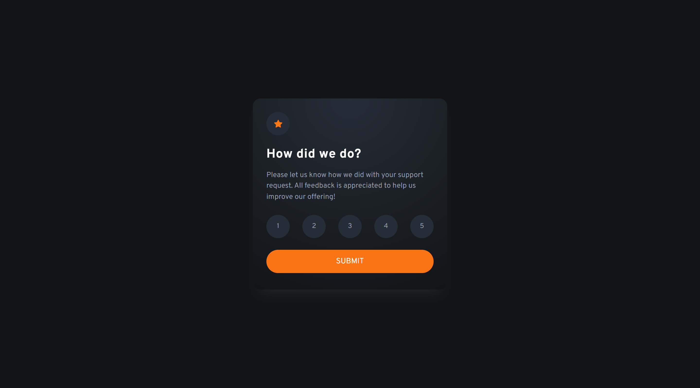
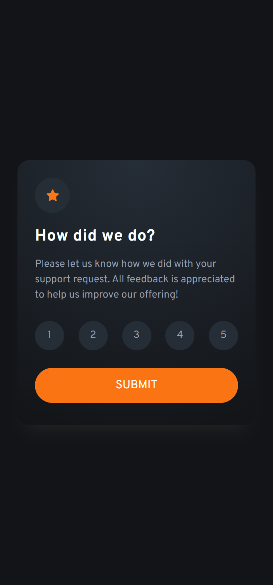

# Frontend Mentor - Interactive rating component solution

## Table of contents

- [Overview](#overview)
  - [The challenge](#the-challenge)
  - [Screenshot](#screenshot)
  - [Links](#links)
- [My process](#my-process)
  - [Built with](#built-with)
- [Author](#author)

## Overview

### The challenge

Users should be able to:

- View the optimal layout for the app depending on their device's screen size
- See hover states for all interactive elements on the page
- Select and submit a number rating
- See the "Thank you" card state after submitting a rating

### Screenshot

| Desktop View                   | Mobile View                  |
| ------------------------------ | ---------------------------- |
|  |  |

### Links

- Solution URL: [Rating Component Solution](https://frontendmentor.io/solutions/)
- Live Site URL: [https://tobiii-irc.vercel.app/](https://tobiii-irc.vercel.app/)

## My process

### Built with

- Semantic HTML5 markup
- CSS custom properties
- Flexbox
- CSS Grid
- Mobile-first workflow

## Author

- Website - [Emmanuel Adeyeye](https://tobiii.onrender.com)
- Frontend Mentor - [@purrrplelipton](https://www.frontendmentor.io/profile/purrrplelipton)
- Twitter - [@purrrplelipton](https://www.twitter.com/purrrplelipton)
